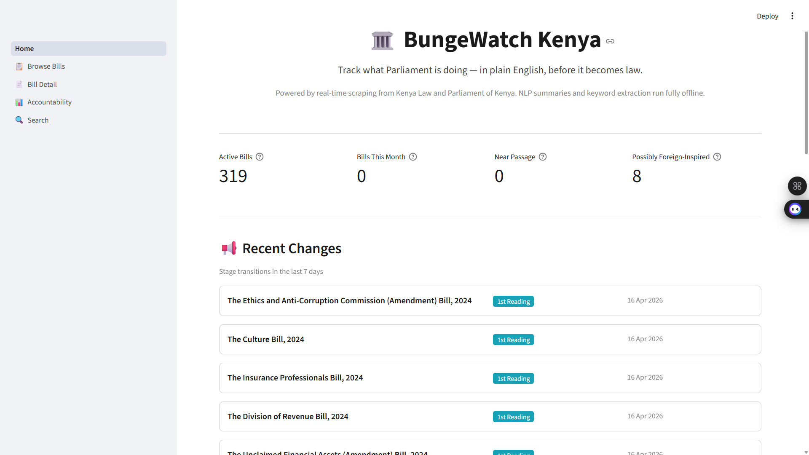
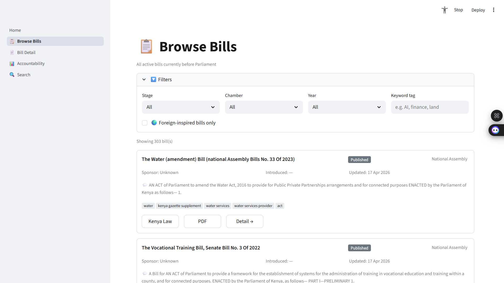
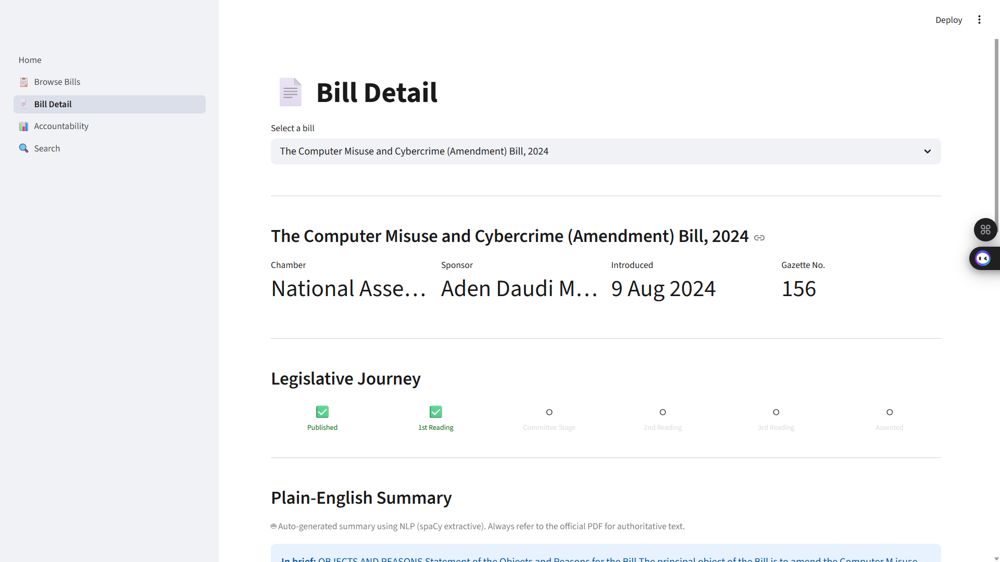
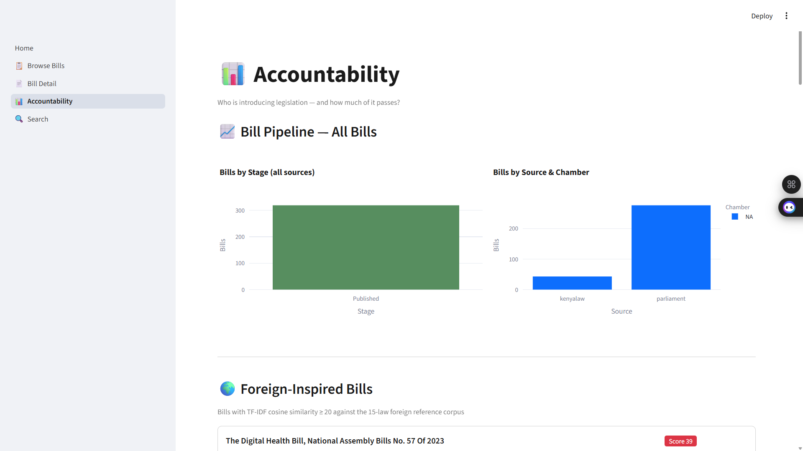
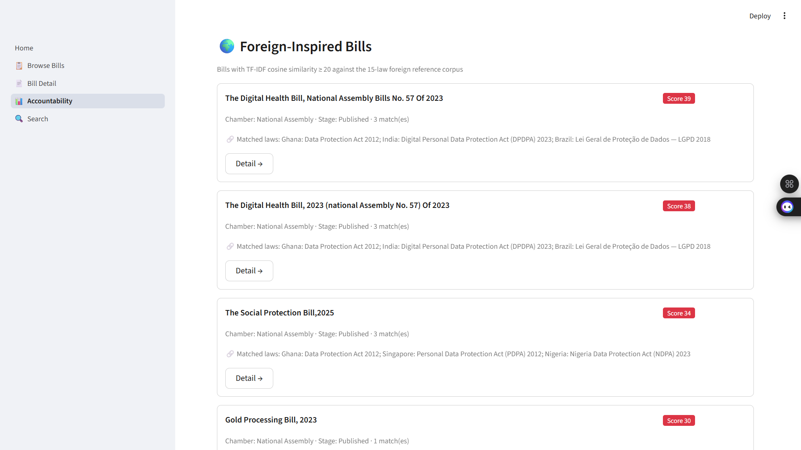
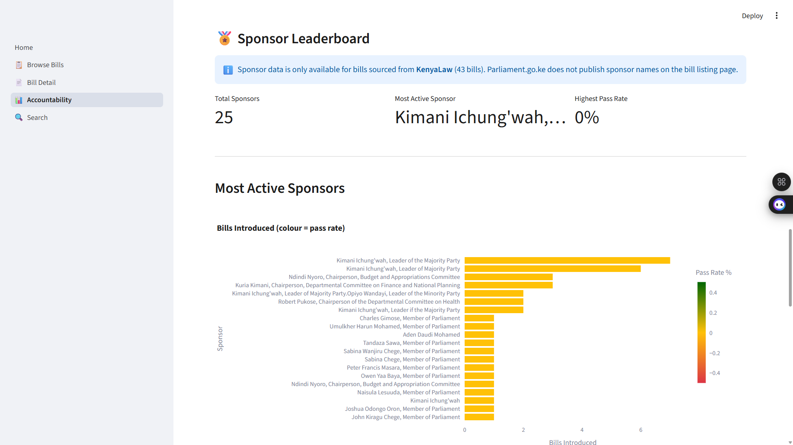
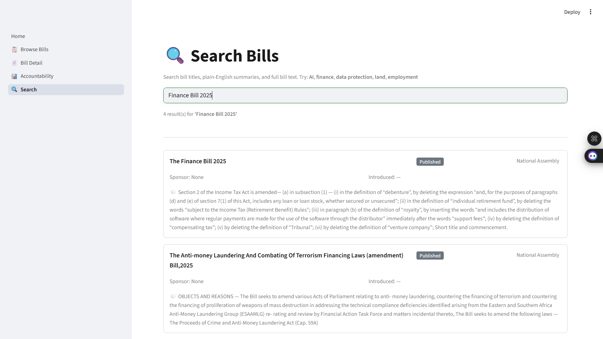

# 🏛️ BungeWatch Kenya: Daily Legislative Intelligence Pipeline

**A production-grade data engineering pipeline that scrapes, parses, and NLP-enriches every bill from Kenya's Parliament — bridging the gap between raw government PDFs and actionable civic intelligence.**

| Metric | Value |
|--------|-------|
| Bills tracked | 319 |
| PDFs downloaded | 319 (100%) |
| Bills parsed (text extracted) | 223 |
| Keywords extracted | 2,230 rows (10 per bill) |
| Plain-language summaries | 223 |
| Foreign law comparisons | 14 matches across 8 bills |
| dbt models / tests | 8 models · 28 tests (all passing) |
| Airflow DAG tasks | 11 |
| Dashboard pages | 4 |

---

## 🎯 Project Goal

Kenya's Parliament publishes hundreds of bills annually across two sources (KenyaLaw and Parliament.go.ke), but most are buried as scanned PDFs with no search capability, no plain-language summaries, and no way to compare them against global legislation. BungeWatch automates the entire pipeline: scraping both sources daily, extracting text from both digital and scanned PDFs via a three-tier parser, enriching each bill with NLP keywords and plain-language summaries, comparing bills against a curated foreign-law reference corpus, and surfacing everything in a Streamlit dashboard — making Kenyan legislative data accessible to citizens, researchers, and analysts.

---

## 🧬 System Architecture

```
KenyaLaw (BS4)          Parliament (Playwright)
      │                          │
      └──────────┬───────────────┘
                 ▼
         detect_changes          ← records new stage transitions (e.g. First → Second Reading)
                 ▼
         download_pdfs           ← requests + retry, local /data/pdfs/ storage
                 ▼
         parse_pdf_text
            pdfplumber           ← fast text-layer extraction
               └─► PyMuPDF       ← complex layout fallback
                     └─► Tesseract OCR  ← page-by-page 150 DPI, 4 parallel workers
                 ▼
         extract_keywords        ← YAKE scoring + spaCy NER noise filter
                 ▼
         generate_summaries      ← spaCy extractive sentence ranking (fully offline)
                 ▼
         compare_foreign_laws    ← TF-IDF cosine similarity vs 15-law corpus
                 ▼
         dbt run / dbt test      ← 8 models, 28 tests
                 ▼
         Streamlit Dashboard     ← 4 pages: Browse · Detail · Accountability · Search
```

All 11 stages run as an **Apache Airflow 3.0 DAG** on a daily schedule (06:00 Africa/Nairobi).

---

## 🛠️ Technical Stack

| **Layer** | **Tool** | **Version** |
|---|---|---|
| Orchestration | Apache Airflow (LocalExecutor) | 3.0 |
| Scraping — static | BeautifulSoup4 + requests | 4.12 |
| Scraping — JS-rendered | Playwright (Chromium headless) | 1.47 |
| PDF parsing — text-layer | pdfplumber | 0.11 |
| PDF parsing — edge cases | PyMuPDF (fitz) | 1.24 |
| PDF parsing — scanned | Tesseract OCR + pdf2image | 5.3 |
| NLP — keywords | YAKE | 0.4.8 |
| NLP — NER + summarisation | spaCy (`en_core_web_sm`) | 3.7 |
| Text similarity | scikit-learn TF-IDF | 1.4 |
| Data storage | PostgreSQL | 15 |
| Data transformation | dbt-core + dbt-postgres | 1.7 |
| Dashboard | Streamlit | 1.40 |
| Containerisation | Docker Compose | 3 services |
| Language | Python | 3.11 |

---

## 📊 Performance & Results

- **319 bills** tracked across 2 official sources (KenyaLaw + Parliament of Kenya)
- **319 PDFs** downloaded (100% download success rate)
- **223 bills parsed** — three-tier extraction; Tesseract OCR covers the majority of Parliament bills which are fully scanned image PDFs
- **OCR runs page-by-page at 150 DPI** across 4 parallel workers — peak RAM stays below 200 MB regardless of PDF size
- **2,230 keywords** extracted (10 per bill) via YAKE + spaCy NER filtering
- **223 plain-language summaries** generated fully offline with zero API cost (spaCy extractive)
- **14 foreign law matches** across 8 bills — compared against 15-law corpus (Uganda, Tanzania, South Africa, UK, India, EU GDPR, AI Act, etc.)
- **8 dbt models · 28 tests** — all passing; staging → intermediate → 4 mart tables
- **4-page Streamlit dashboard** — Browse, Bill Detail (with URL deep-linking), Accountability, Search
- **11-task Airflow DAG** with XCom state passing, retries, and exponential backoff

---

## 📸 Dashboard

### Home — Legislative Overview



*Hero metrics: total bills tracked, parsed, and enriched. Daily pipeline status.*

### Browse Bills — Full Bill Browser



*Filter by source, chamber, and stage. Click Detail → to deep-link to a specific bill.*

### Bill Detail — Per-Bill Intelligence



*Full extracted text, top 10 YAKE keywords, 3–5 sentence plain-language summary, and foreign law comparison matches.*

### Accountability — Bill Pipeline Overview



*Stage distribution and source/chamber breakdown for all 319 bills.*

### Accountability — Foreign-Inspired Bills



*Bills with TF-IDF cosine similarity ≥ 20 against the 15-law foreign reference corpus, with matched jurisdictions and similarity scores.*

### Accountability — Sponsor Leaderboard



*Sponsor league table with pass rates (KenyaLaw bills). Note: Parliament.go.ke does not publish sponsor names on the bill listing page.*

### Search — Full-Text Search



*Full-text keyword search across all parsed bill text using PostgreSQL tsvector.*

---

## 📑 Data Sources

| Source | Method | Coverage |
|--------|--------|----------|
| [KenyaLaw](https://kenyalaw.org) | BeautifulSoup4 — paginated static HTML | National Assembly + Senate bills |
| [Parliament of Kenya](https://parliament.go.ke) | Playwright — Drupal Views AJAX rendering | 13th Parliament (2022–) bills |
| Foreign Laws corpus | Seeded CSV (15 reference laws) | Uganda, Tanzania, South Africa, UK, India, EU |

---

## 🧠 Key Design Decisions

- **Three-tier PDF parser with graceful fallback** — Kenya's Parliament publishes both text-layer PDFs (newer bills) and fully scanned image PDFs (older bills). Using pdfplumber alone would silently return empty for ~60% of Parliament bills. The cascade (pdfplumber → PyMuPDF → Tesseract) ensures maximum coverage. The `diagnose_pdf` function logs PDF internals (page count, encryption, image density) when all three parsers fail.

- **Page-by-page OCR at 150 DPI instead of bulk conversion** — loading an entire 300-page scanned bill at 200 DPI into memory would require ~2 GB RAM per worker and caused OOM kills. Processing one page at a time with `convert_from_path(first_page=N, last_page=N)` at 150 DPI keeps peak RAM below 200 MB per worker regardless of bill size.

- **4-worker ThreadPoolExecutor for parallel OCR** — Tesseract is CPU-bound but Airflow runs in a single Python process. Using `ThreadPoolExecutor(max_workers=4)` saturates available CPU cores without spawning separate processes, avoiding inter-process coordination overhead.

- **Offline NLP with no API dependency** — summaries and keyword extraction use spaCy + YAKE, running entirely locally. The pipeline runs indefinitely with zero API cost. An `ANTHROPIC_API_KEY` in `.env.example` is documented but genuinely optional.

- **Playwright for Parliament.go.ke instead of direct HTTP** — the bills listing page is rendered by Drupal Views via AJAX; a plain `requests.get` returns an empty table. Playwright intercepts the fully rendered DOM after JavaScript executes, making it the only reliable approach without reverse-engineering private API endpoints.

- **dbt as the single source of truth for analytics tables** — all mart tables are produced by dbt with column-level documentation and automated tests. The Streamlit app only reads from mart views, never raw tables.

- **`foreign_match_checked_at` stamp to prevent re-scanning** — bills with no foreign law matches above the similarity threshold are stamped after first scan. A partial GIN index on `foreign_match_checked_at IS NULL` ensures subsequent DAG runs only scan newly parsed bills, not all 319 every day.

- **`years` filter in `parse_all_downloaded()`** — the DAG targets only 2025/2026 Parliament bills on each run, avoiding re-processing historical bills already confirmed as scanned-only with no recoverable text.

---

## 📂 Project Structure

```text
bungewatch/
├── dags/
│   └── bungewatch_pipeline_dag.py    # Airflow DAG — 11 tasks, daily at 06:00 EAT
├── pipeline/
│   ├── config.py                     # Settings (pydantic-settings + .env)
│   ├── db.py                         # SQLAlchemy engine + upsert helpers
│   ├── logger.py                     # Structured logging + scrape_run context manager
│   ├── change_detector.py            # Stage transition detector
│   ├── pdf_downloader.py             # PDF fetch + retry
│   ├── pdf_parser.py                 # Three-tier PDF text extractor (OCR capable)
│   ├── keyword_extractor.py          # YAKE + spaCy keyword pipeline
│   ├── claude_summarizer.py          # Extractive spaCy summarizer
│   └── foreign_law_matcher.py        # TF-IDF foreign law comparison
├── scrapers/
│   ├── kenyalaw_scraper.py           # KenyaLaw BS4 scraper
│   ├── parliament_scraper.py         # Parliament.go.ke Playwright scraper
│   └── selectors.py                  # CSS/XPath selector constants
├── dbt/
│   ├── models/
│   │   ├── staging/                  # stg_kenyalaw_bills, stg_parliament_bills
│   │   ├── intermediate/             # int_bills_unified, int_bill_stages
│   │   └── marts/                    # mart_active_bills, mart_bill_timeline,
│   │                                 #   mart_keyword_frequency, mart_sponsor_stats
│   ├── seeds/                        # Foreign laws reference CSV seed
│   └── dbt_project.yml
├── streamlit_app/
│   ├── Home.py                       # Landing page with hero metrics
│   └── pages/
│       ├── 1_📋_Browse_Bills.py      # Full bill browser with source/chamber/stage filters
│       ├── 2_📄_Bill_Detail.py       # Per-bill deep dive — text, keywords, summary, foreign matches
│       ├── 3_📊_Accountability.py    # Sponsor stats + stage funnel from dbt marts
│       └── 4_🔍_Search.py           # Full-text search across all parsed bill text
├── sql/
│   ├── 001_schema.sql                # 14-table schema (Bronze → Silver → Gold → Ops)
│   └── 002_indexes.sql               # Performance indexes incl. partial GIN index
├── tests/
│   └── test_change_detector.py       # Unit tests for stage transition logic
├── docker-compose.yml                # postgres + airflow-scheduler + streamlit
├── Dockerfile.airflow                # Airflow + Tesseract + Playwright + dbt + spaCy
├── requirements.txt                  # Core Python deps
├── requirements.airflow.txt          # Airflow + NLP deps (spaCy, YAKE, pdfplumber, etc.)
└── .env.example                      # All required env vars documented
```

---

## ⚙️ Installation & Setup

### Prerequisites

- Docker Desktop (4 GB RAM minimum — OCR is memory-intensive)
- Git

### Quick start

```bash
git clone https://github.com/declerke/BungeWatch.git
cd bungewatch
cp .env.example .env
# Edit .env — generate a Fernet key and set AIRFLOW_ADMIN_PASSWORD
docker compose up -d --build
```

The Airflow init container creates the schema on first boot; the scheduler picks up the DAG automatically.

| Service | URL |
|---------|-----|
| Airflow UI | http://localhost:8080 |
| Streamlit dashboard | http://localhost:8501 |

### Trigger a pipeline run

```bash
# Full DAG via Airflow
docker exec bungewatch-airflow-scheduler-1 airflow dags trigger bungewatch_pipeline

# Or run individual stages directly
docker exec bungewatch-airflow-scheduler-1 python3 -c "
import sys; sys.path.insert(0, '/opt/airflow')
from pipeline.pdf_parser import parse_all_downloaded
print(parse_all_downloaded(years=[2025, 2026]))
"
```

### dbt only

```bash
docker exec bungewatch-airflow-scheduler-1 bash -c "
  cd /opt/airflow/dbt && \
  dbt run --profiles-dir /opt/airflow/dbt && \
  dbt test --profiles-dir /opt/airflow/dbt
"
```

---

## 🗄️ dbt Models

| Model | Layer | Description |
|-------|-------|-------------|
| `stg_kenyalaw_bills` | Staging | Cleaned KenyaLaw bill records |
| `stg_parliament_bills` | Staging | Cleaned Parliament bill records |
| `int_bills_unified` | Intermediate | Deduplicated union of both sources |
| `int_bill_stages` | Intermediate | One row per stage transition |
| `mart_active_bills` | Mart | All current bills with latest stage + metadata |
| `mart_bill_timeline` | Mart | Stage progression timelines per bill |
| `mart_keyword_frequency` | Mart | Cross-bill keyword frequency rankings |
| `mart_sponsor_stats` | Mart | Bills per sponsor/party with stage counts |

All 28 dbt tests pass — not-null, unique, accepted-values, and referential integrity checks.

---

## 🎓 Skills Demonstrated

- **Data engineering** — end-to-end batch pipeline from web scraping through NLP enrichment to analytics marts
- **Orchestration** — Airflow 3.0 DAG with 11 tasks, task dependencies, XCom state passing, retries, and exponential backoff
- **Web scraping** — static HTML (BS4) and JS-rendered SPA (Playwright) sources in the same pipeline
- **Document processing** — multi-strategy PDF parsing with OCR fallback; production-safe page-by-page memory management
- **NLP** — keyword extraction (YAKE), extractive summarisation (spaCy), text similarity (TF-IDF cosine)
- **dbt** — layered transformation (staging → intermediate → marts), schema tests, referential integrity, column docs
- **Docker** — custom Airflow image with Tesseract, Playwright, dbt, and all NLP models pre-installed
- **PostgreSQL** — schema design, upsert patterns, partial indexes, tsvector full-text search
- **Civic tech** — applying production data engineering to public accountability in a Kenyan legislative context

---

## License

MIT
